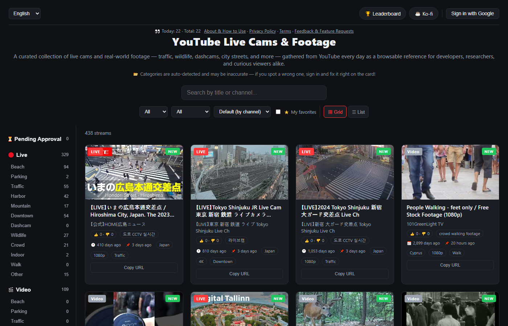

# 📹 Camlisted — YouTube Live Cams & Footage

**Live site: [camlisted.com](https://camlisted.com)**

A daily-updated, categorized directory of publicly available YouTube live cams and real-world footage — traffic cams, beaches, wildlife feeds, dashcams, city streets, and more. No video is ever hosted, downloaded, or re-encoded: every entry links to (or embeds, via the official player) the original stream on YouTube.



## Why

Finding good live cams on YouTube is painful: search results are cluttered, streams constantly go offline, and there's no way to browse by category. Camlisted automates the whole loop — it discovers streams daily, verifies they're still alive, classifies them, and prunes dead links, so the directory stays fresh without manual curation.

## Features

- **Daily auto-discovery** — searches YouTube in ~15 languages for live cams, dashcam and street footage, within the free API quota
- **Liveness tracking** — offline streams get a 7-day countdown overlay, then are removed (and can return if they come back online)
- **12 categories** with per-category counts, auto-classified by multilingual keywords and correctable by the community
- **Viewport autoplay** — cards play a muted preview while scrolled into view
- **Community layer** — Google sign-in, link submissions with a review flow, up/downvotes, favorites with notes, comments, feedback board, leaderboard with membership tiers
- **Moderation** — pending-approval queue with bulk approve, video/channel blocklists so removed content never resurfaces
- **5 languages** (EN/KO/JA/ZH/ES), infinite scroll, quality & date filters, XLSX/TXT export of favorites

## Architecture

```
┌─────────────────┐   daily cron    ┌──────────────────┐
│ GitHub Actions   │ ──────────────▶│ YouTube Data API │
│ scripts/update.mjs│               └──────────────────┘
└────────┬────────┘
         │ service role
         ▼
┌─────────────────┐    anon key +   ┌──────────────────┐
│ Supabase        │ ◀──────────────│ Static frontend   │
│ Postgres + Auth │      RLS       │ (GitHub Pages)    │
│ + RPC/triggers  │                │ vanilla HTML/JS   │
└─────────────────┘                └──────────────────┘
```

- **Frontend**: dependency-free vanilla HTML/CSS/JS, hosted free on GitHub Pages
- **Backend**: Supabase free tier — Postgres with Row Level Security, Google OAuth, and `security definer` functions for privileged operations
- **Automation**: a single Node script run by GitHub Actions handles discovery, liveness checks, classification, credit grants, and cleanup
- **Quota budgeting**: YouTube's `search.list` allows ~100 calls/day; the script budgets these across keyword rotations and uses cheap `videos.list`/`channels.list` calls for everything else

## Running your own instance

See [docs/SETUP.ko.md](docs/SETUP.ko.md) (Korean) for the full setup guide: YouTube API key, Supabase project + SQL schema, Google OAuth, and GitHub Actions secrets. The SQL migrations in [`sql/`](sql/) are numbered in the order they were applied.

## License

[MIT](LICENSE) — the code is free to use. Video content belongs to its respective YouTube creators and is subject to [YouTube's Terms of Service](https://www.youtube.com/t/terms).
